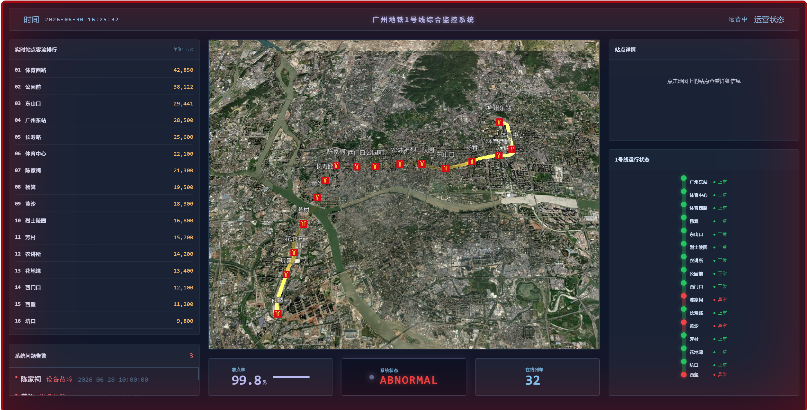

# Guangzhou Metro Monitor System

广州地铁 1 号线综合监控系统 WebGIS 原型。

项目基于 CesiumJS、原生 JavaScript 和 FastAPI 构建，前端负责 3D 地图展示、站点交互和监控面板渲染，后端从 SQLite 数据库提供数据接口。

> 当前数据主要为学习和演示用途，站点客流、运行状态等为模拟数据，不代表真实运营数据。

---



---

## 功能

- Cesium 3D 地图展示广州地铁 1 号线线路，金色流光动画效果
- 加载 GeoJSON 站点坐标并渲染站点图标和标签
- 点击站点后展示站名、换乘信息、是否换乘站和客流量
- 站点客流排行
- 线路运行状态（绿/红点）和异常告警列表
- 准点率、系统状态、在线列车数等监控指标
- 全屏红色告警边框（站点异常时触发）
- FastAPI 后端提供统一数据接口

---

## 技术栈

| 模块 | 技术 |
| --- | --- |
| 前端 | HTML, CSS, JavaScript, Tailwind CSS |
| 三维地图 | CesiumJS 1.137 |
| 后端 | Python, FastAPI, Uvicorn |
| 数据库 | SQLite, SQLAlchemy ORM |
| 动画 | GLSL 自定义着色器材质（流线动画） |

---

## 项目结构

```text
Guangzhou-Metro-Monitor-System/
├── backend/
│   ├── main.py                         # FastAPI 后端接口
│   ├── database.py                     # SQLite 数据库连接配置
│   ├── models.py                       # ORM 数据表结构定义
│   └── init.py                         # 数据初始化导入脚本
├── data/
│   ├── stations.json                   # 站点属性数据
│   ├── status.json                     # 运行状态和告警数据
│   ├── dashboard.json                  # 仪表盘数据
│   ├── GZLine1.geojson                 # 1 号线线路 GeoJSON
│   ├── GZLine1_Station.geojson         # 1 号线站点 GeoJSON
│   └── GZ_FS_Metro.geojson             # 广州地铁线网数据
├── frontend/
│   ├── index.html                      # 前端页面
│   ├── style.css                       # 页面样式
│   ├── GZmetro.jpg                     # 站点图标
│   ├── apikey.txt                      # Cesium Ion Token，本地创建，不提交
│   └── js/
│       ├── cesium.js                   # Cesium 初始化、线路和站点渲染
│       ├── info.js                     # 站点点击详情
│       ├── ranking.js                  # 客流排行
│       ├── alarm.js                    # 运行状态和告警
│       ├── dashboard.js                # 仪表盘指标
│       ├── time.js                     # 时间和运营状态
│       └── PolylineTrailLinkMaterialProperty.js   # 自定义 GLSL 流光材质
├── .gitignore
└── README.md
```

---

## 后端接口

| 接口 | 说明 | 数据源 |
| --- | --- | --- |
| `GET /cesium` | 返回 Cesium Ion Token | 文件 |
| `GET /dashboard` | 返回仪表盘指标 | SQLite |
| `GET /status` | 返回站点运行状态和告警 | SQLite |
| `GET /ranking` | 返回站点属性和客流数据 | SQLite |
| `GET /stationPoint` | 返回站点坐标 | SQLite |
| `GET /line` | 返回线路 GeoJSON | 文件 |
| `GET /logo` | 返回站点图标 | 文件 |
| `GET /info` | 返回完整站点数据 | JSON 文件 |

---

## 运行方式

### 1. 准备 Cesium Token

在 `frontend/` 目录下创建 `apikey.txt`，写入自己的 Cesium Ion Access Token。

```text
frontend/apikey.txt
```

`apikey.txt` 已加入 `.gitignore`，不要提交到 GitHub。

### 2. 安装后端依赖

```bash
pip install -r requirements.txt
```

### 3. 初始化数据库（可选）

```bash
python backend/init.py
```

### 4. 启动后端

```bash
python -m uvicorn backend.main:app --reload --port 8000
```

后端启动后可以访问 `http://127.0.0.1:8000/docs` 查看 Swagger API 文档。

### 5. 启动前端静态服务

在项目根目录执行：

```bash
python -m http.server 8002
```

浏览器打开 `http://127.0.0.1:8002/frontend/index.html`。

---

## 数据流

```text
frontend/js/*.js
        |
        | fetch("http://127.0.0.1:8000/...")
        v
backend/main.py
        |
        | ┌─ SQLite 数据库（dashboard, status, ranking, stationPoint）
        | └─ 直接读文件（cesium, line, logo, info）
        v
返回 JSON / GeoJSON / 图片给前端
```

前端所有数据均通过 FastAPI 接口获取，不直接读取本地文件。

数据库使用 SQLite（`data/metro.db`），通过 `init.py` 从 JSON 文件导入初始数据。

```bash
python backend/init.py      # 从 JSON 文件导入数据到 SQLite
```

---

## 当前状态

项目已完成基础功能闭环，处于原型完善阶段。

### 已完成功能

- Cesium 3D 地球场景搭建，相机固定广州区域
- 1 号线线路渲染 + 金色流光动画（自定义 GLSL Material）
- 16 个站点图标 + 名称标注
- 站点点击交互（点击地图站点 → 右侧详情面板）
- 左侧客流排行（实时排序展示）
- 右侧运行状态图（绿点正常 / 红点异常）
- 系统告警面板 + 全屏红色闪烁边框
- 底部仪表盘卡片（准点率、系统状态、在线列车数）
- 实时时钟 + 运营时段判断（06:00 - 24:00）
- 深色主题 + 毛玻璃效果 + 科技感 UI
- FastAPI 后端 8 个数据接口
- SQLite 数据库 + SQLAlchemy ORM 搭建完成，可通过 init.py 导入数据
- 4 个 API 接口从 JSON 文件迁移至 SQLite 数据库查询（dashboard / status / ranking / stationPoint）

### 后续计划

- 添加数据写入/更新接口，实现数据动态更新
- 客流排行定时从 API 刷新（目前仅前端 setInterval 重渲染）
- 仪表盘定时轮询

---

## 学习笔记

本项目中涉及的知识点：

- Cesium 场景搭建：Viewer 初始化、控件配置、相机飞行定位
- GeoJSON 数据处理：从 Shapefile 导出、CRS 坐标参考系处理、Cesium 加载适配
- Cesium Entity 管理：Billboard（图标）、Label（标签）、Polyline（路径）
- 自定义 Cesium Material：通过 GLSL 着色器实现自定义材质效果（流光动画）
- 场景拾取交互：ScreenSpaceEventHandler 实现点击检测与 Entity 信息读取
- CSS 布局：Grid 网格布局、Flexbox 弹性布局、毛玻璃效果
- 前端数据流：fetch 异步加载、JSON 解析、DOM 渲染
- CSS 动画：关键帧动画实现闪烁告警效果
- FastAPI 后端：CORS 中间件、JSON/GeoJSON/图片文件服务

---
## License

MIT
